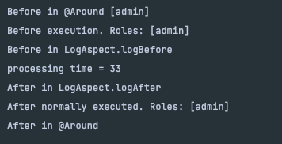

### TODO
- intercept call via JoinPoint
- read metadata of annotataion from Advice

### REFERENCE
- https://github.com/bitsmuggler/spring-boot-with-aop

### ISSUE
- JoinPoint가 정확이 뭔지
- aspectj? spring aop? 
- aop 타켓 메서드에 중단점 설정하고 디버깅하면 AOP 동작 과정 다 확인 가능!
- 타켓 메서드에 AOP 여러개 붙여보니.. 

 
